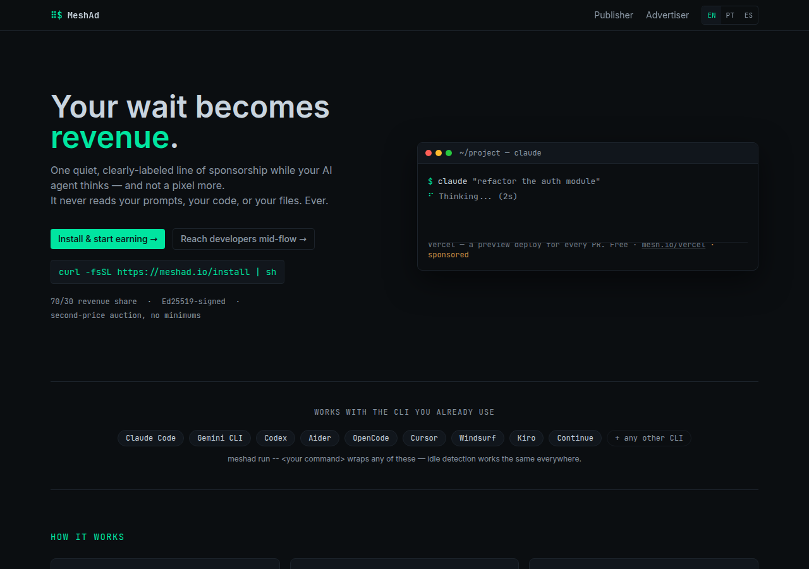
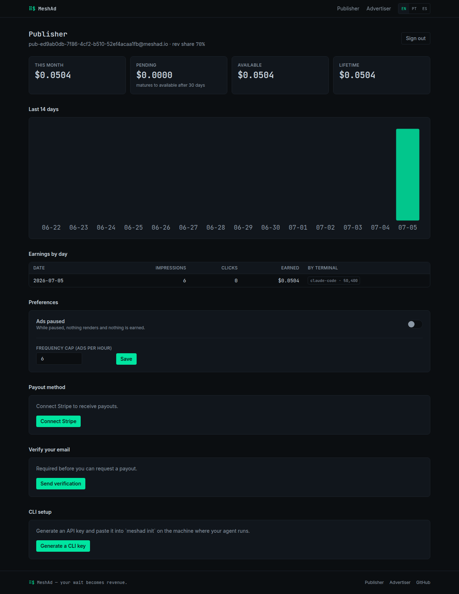
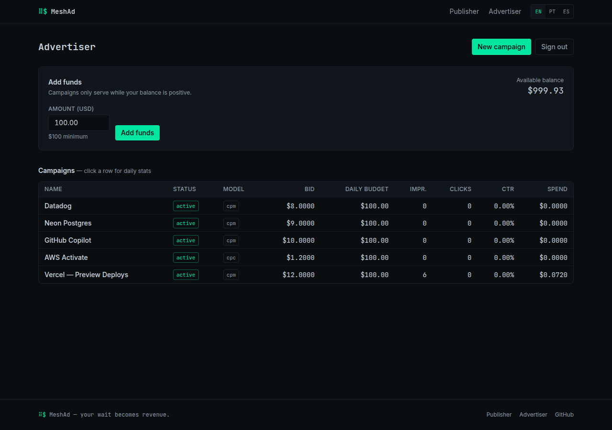

<p align="center">
  
</p>

<h1 align="center">MeshAd</h1>

<p align="center">
  Privacy-first monetization for AI agents, coding CLIs and developer terminals.
</p>

<p align="center">
  <a href="https://meshad.io"><strong>Website</strong></a> ·
  <a href="https://api.meshad.io/healthz"><strong>API Health</strong></a> ·
  <a href="#product-screenshots"><strong>Screenshots</strong></a> ·
  <a href="#how-it-works"><strong>How it works</strong></a>
</p>

---

## The idea

AI agents spend real time thinking, planning, indexing and executing. MeshAd turns that idle window into a premium, privacy-safe ad placement:

- the campaign appears only while the agent is processing;
- it disappears when the answer is ready;
- prompts, code, files, repositories and model responses never leave the user's machine;
- publishers earn from useful, clearly-labelled sponsorships;
- advertisers reach builders at the exact moment they are buying tools, infra and compute.
- developers receive money through a controlled MeshAd ledger: earnings start pending, mature after antifraud checks, then can be paid out by Stripe/PayPal/USDC when the owner settles the payout in the admin console;
- the owner keeps control over revenue share, publisher suspension, payout methods, moderation and payout settlement.

> Never spy. Never interrupt. Never degrade.

## Product screenshots

### Landing experience


### Publisher dashboard



### Advertiser dashboard



## Install the CLI

```bash
curl -fsSL https://meshad.io/install | sh
meshad init
```

The CLI's source lives in [`cli/`](cli) — mirrored here from the private core
repository so it can be installed standalone, without access to the core
platform's source. See [`cli/README.md`](cli/README.md) for the full command
reference and the privacy contract in detail.

## How it works

```txt
1. Install MeshAd in an AI-agent workflow.
2. The client observes only timing metadata: idle_start, idle_end, duration, anon_id, terminal_type.
3. A signed campaign is rendered while the agent thinks.
4. The campaign is cleared automatically when the agent answers.
5. Valid impressions are recorded and publisher earnings accrue.
```

## Privacy contract

MeshAd does not collect:

- prompts;
- source code;
- generated answers;
- filenames or repository names;
- terminal output content;
- project context.

The public telemetry contract is intentionally tiny and auditable.

## Launch architecture

```txt
Developer CLI / SDK
        │
        ▼
MeshAd API ── campaign auction ── signed ad pack
        │
        ├─ privacy telemetry allowlist
        ├─ fraud/rate checks
        ├─ double-entry ledger
        └─ publisher / advertiser dashboards
```

## Repository model

This public repository is the launch/landing hub: screenshots, positioning,
public-facing documentation, and a mirror of the CLI's source (`cli/`) so it
can be installed without access to the private core.

The production core (API, auction, fraud detection, ledger, dashboard)
remains private.

## Domain

- Main site: https://meshad.io
- API: https://api.meshad.io

## Status

MeshAd is in beta preparation for VPS deployment and domain launch.

If you believe agent workflows deserve a business model that respects developers, star this repository and follow the launch.
